<h3><code>websboy10@github ~ $ ./contributions.sh</code></h3>

  

<h3><code>websboy10@github ~ $ whoami</code></h3>

  

<h3><code>websboy10@github ~ $ ls projects/</code></h3>

| | |
|---|---|
| **ScooterVoice** | Hands-free Claude Code: talk to a coding agent from a scooter, hear the answer back. Swift + a relay to the Mac. |
| **Nordic Engine** | Internal CRM with a Danish UI. Next.js + Postgres, per-user isolation enforced with row-level security. |
| **Dialer** | Outbound-calling workflow tool for a small sales team. TypeScript. |
| **Road to Success** | Habit tracker for iOS. SwiftUI + a Supabase backend. |
| [**loop-engineering**](https://github.com/websboy10/loop-engineering) | Fork of [cobusgreyling/loop-engineering](https://github.com/cobusgreyling/loop-engineering): patterns and CLI tools for running AI coding agents in loops. |
| [**sehit-studio**](https://sehit-studio.vercel.app) | Cinematic WebGL portfolio built with TypeScript and Three.js. |

 

<h3><code>websboy10@github ~ $ cat ai-setup.md</code></h3>

- **Claude Code as the daily driver**, driven by spec-first phases: scope → plan → execute → verify.
- **Subagents on a leash:** two at a time, each with a narrow prompt, each report treated as a claim to check.
- **MCP everywhere:** database, browser automation, payments, deploys, analytics, all wired into one agent.
- **Scheduled cloud routines** run recurring work without the laptop on.
- **Persistent file-based memory** so decisions and lessons survive between sessions.
- **One rule above the rest:** "it's finished" only counts once the running behaviour has been observed end to end. Passing tests and a green build are not proof.
